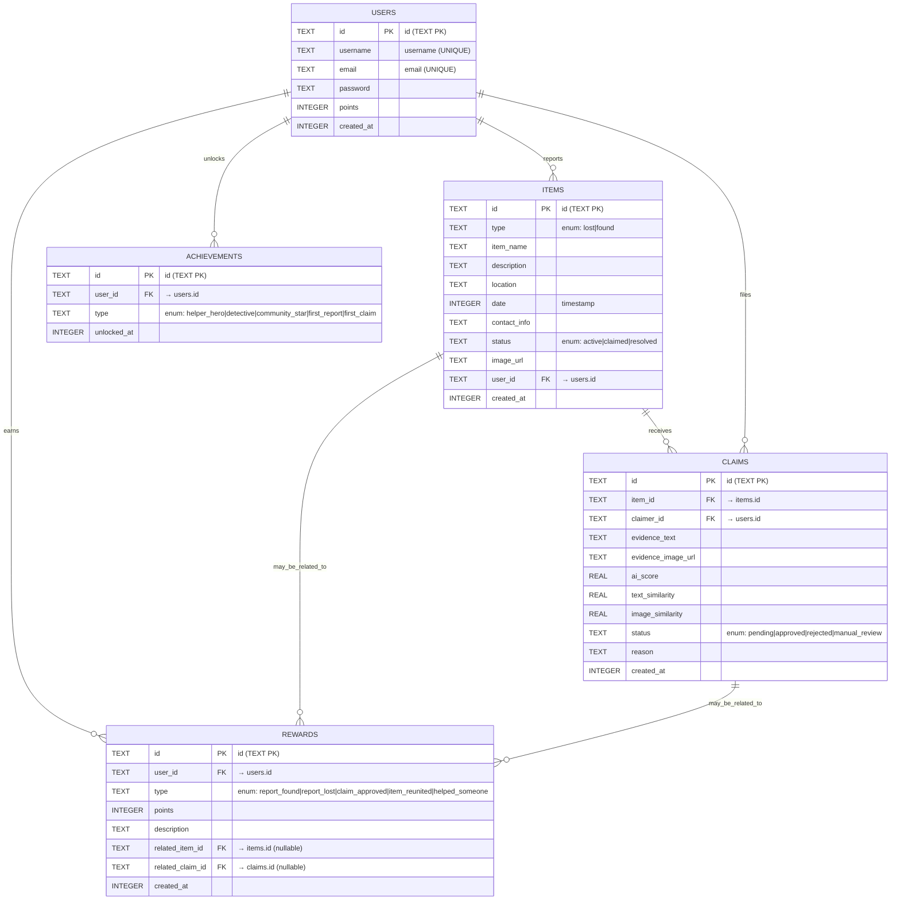

```mermaid
erDiagram
    USERS {
      TEXT id PK "id (TEXT PK)"
      TEXT username "username (UNIQUE)"
      TEXT email "email (UNIQUE)"
      TEXT password
      INTEGER points
      INTEGER created_at
    }

    ITEMS {
      TEXT id PK "id (TEXT PK)"
      TEXT type "enum: lost|found"
      TEXT item_name
      TEXT description
      TEXT location
      INTEGER date "timestamp"
      TEXT contact_info
      TEXT status "enum: active|claimed|resolved"
      TEXT image_url
      TEXT user_id FK "→ users.id"
      INTEGER created_at
    }

    CLAIMS {
      TEXT id PK "id (TEXT PK)"
      TEXT item_id FK "→ items.id"
      TEXT claimer_id FK "→ users.id"
      TEXT evidence_text
      TEXT evidence_image_url
      REAL ai_score
      REAL text_similarity
      REAL image_similarity
      TEXT status "enum: pending|approved|rejected|manual_review"
      TEXT reason
      INTEGER created_at
    }

    REWARDS {
      TEXT id PK "id (TEXT PK)"
      TEXT user_id FK "→ users.id"
      TEXT type "enum: report_found|report_lost|claim_approved|item_reunited|helped_someone"
      INTEGER points
      TEXT description
      TEXT related_item_id FK "→ items.id (nullable)"
      TEXT related_claim_id FK "→ claims.id (nullable)"
      INTEGER created_at
    }

    ACHIEVEMENTS {
      TEXT id PK "id (TEXT PK)"
      TEXT user_id FK "→ users.id"
      TEXT type "enum: helper_hero|detective|community_star|first_report|first_claim"
      INTEGER unlocked_at
    }

    %% Relationships (cardinalities)
    USERS ||--o{ ITEMS : "reports"
    ITEMS ||--o{ CLAIMS : "receives"
    USERS ||--o{ CLAIMS : "files"
    USERS ||--o{ REWARDS : "earns"
    ITEMS ||--o{ REWARDS : "may_be_related_to"
    CLAIMS ||--o{ REWARDS : "may_be_related_to"
    USERS ||--o{ ACHIEVEMENTS : "unlocks"
```
